<!-- HEADER BANNER -->

  

   

**`Full Stack Software Developer`**

<!-- https://user-images.githubusercontent.com/45147588/112335509-4f8bed80-8ce2-11eb-9ee5-93de00d035a7.png -->

<h3 align="center"> नमस्ते (Namaste), I'm Tirtha Sharma 

   

</h3>

<h3 align="center"> A Passionate Full-Stack Software Developement Engineer from India ❤ </h3>

-----

🚀 30 Y/O **Full Stack Software Development Engineer** from **India** .

💻 Passionate about crafting innovative solutions in **Full-Stack Software Development**, blending creativity with technology to solve **complex** challenges.  

✨ **I thrive on:-**

   - 🤖 **Automation:-** Simplifying workflows, building efficient pipelines, and eliminating redundancies. 
   - 🛠️ **Product Development:-** Designing scalable, user-centric applications that drive impact. 
   - 📈 **Scalability Solutions:-** Tackling challenges in scaling systems while enhancing performance and efficiency. 
   
- ☁️ **Cloud Computing Enthusiast:-** Harnessing the power of the cloud to deliver robust and flexible solutions. 
- 🚀 **DevOps Advocate:-** Bridging the gap between development and operations for seamless integration. 
- 🤖 **Innovation and Automation:-** Always exploring new ways to integrate intelligent systems into everyday tasks. 

 
  
 

## 🏆 GitHub Trophies

  

### 🏋 More about me

- 🔭 **Currently Building:-** Scalable and high-performing solutions within the **Front-End Development ecosystem.**

- 🌱 **Lifelong Learner:-** Actively exploring **Data Science** to expand my skill set and discover new opportunities.

- 👯 **Collaboration Enthusiast:-** Open to contributing to innovative Open Source projects that create impact.

- 🕷️ **AI Advocate:-** Harnessing the power of AI tools like **ChatGPT**, **Perplexity.ai**, **Bolt.new**, **GitHub Copilot**, **Cursor AI**, **Claude**, and **MidJourney** to optimize                              workflows, boost creativity, and supercharge productivity.

- 💬 **Ask Me About:-** 
  
  -  **Java Development:-** Efficient and clean backend solutions.
  -  **Web Development:-** Interactive and responsive front-end experiences.
  -  **Python Development:-** Data-driven applications and scripts.

- 📫 **How to reach me:-** **tirthagenze121@gmail.com**

- 😄 **Pronouns:-** He/Him/His

- ⚡ **Fun Fact:-** My humor might surprise you—I think I’m funny (and I often am!).

- ☕ **Interests:** A perfect blend of **Cats**, **Coffee**, and **Coding** keeps me motivated.

- 🎮 **Hobbies:-** Crafting innovative products and immersive games.

- 🥷 **Quote I Live By:-** <i>"Tough times never last, but tough people do."</i>

- 🚀 **Tech Visionary:-** Continuously pushing the boundaries of what’s possible by blending **artistry**, **technology**, and **collaboration** to craft solutions that inspire and transform.

 

### 🔗 Connect with me 

 
 
 
 

 

### 🧰 Tech Stack and Tools 

<table>
     <tr>
        <td style="font-weight: bold; padding-right: 10px; vertical-align: center;">Frontend:</td>
        <td></td>
    </tr>
    <tr>
        <td style="font-weight: bold; padding-right: 10px; vertical-align: center; border: none;">Backend:</td>
        <td></td>
    </tr>
    <tr>
        <td style="font-weight: bold; padding-right: 10px; vertical-align: center; border: none;">Database:</td>
        <td></td>
    </tr>
    <tr>
        <td style="font-weight: bold; padding-right: 10px; vertical-align: center; border: none;">DevOps:</td>
        <td></td>
    </tr>
    <tr>
        <td style="font-weight: bold; padding-right: 10px; vertical-align: center; border: none;">Automated test:</td>
        <td></td>
    </tr>
    <tr>
        <td style="font-weight: bold; padding-right: 10px; vertical-align: center; border: none;">Version Control:</td>
        <td></td>
    </tr>
    <tr>
        <td style="font-weight: bold; padding-right: 10px; vertical-align: center; border: none;">Ides:</td>
        <td></td>
    </tr>
    <tr>
        <td style="font-weight: bold; padding-right: 10px; vertical-align: center; border: none;">Other Tools:</td>
        <td></td>
    </tr>
    <tr>
        <td style="font-weight: bold; padding-right: 10px; vertical-align: center; border: none;">Operating Systems:</td>
        <td></td>
    </tr>
  <tr>
        <td style="font-weight: bold; padding-right: 10px; vertical-align: center; border: none;">API Tools:</td>
        <td></td>
    </tr>
 <tr>
        <td style="font-weight: bold; padding-right: 10px; vertical-align: center; border: none;">Hosting:</td>
        <td> 
       </td>
 </tr>
<tr>
    <td style="font-weight: bold; padding-right: 10px; vertical-align: center; border: none;">AI Tools:</td>
    <td>
      
      
      
    </td>

</tr>
 <tr>
        <td style="font-weight: bold; padding-right: 10px; vertical-align: center; border: none;">Learning Platforms:</td>
        <td>  
         
        </td>
   </tr>
  <tr>
        <td style="font-weight: bold; padding-right: 10px; vertical-align: center; border: none;">Competitive Coding:</td>
        <td>
 
       </td>
 </tr>
</table>

 

### 📈 Github Stats

 <table>
  <tr>
    <td width="1000">
      <a href="https://github.com/bloedboemmel">
         
      </a>
    </td>
    <td width="1000">
       
    </td>
  </tr>
</table>

    <a href="https://github.com/DenverCoder1/github-readme-streak-stats">
      <!-- Use https://streak-stats.demolab.com or self-host with your own Vercel app - visit https://git.io/streak-stats for instructions -->
      
    </a>
    
🔥 Get streak stats for your profile at <a href="https://git.io/streak-stats">git.io/streak-stats</a>

  

<!--  -->

  

  

## 🎧 Spotify Music

- [x] 🔥✅ Credits: [Tirtha Sharma](https://github.com/genze121 "Tirtha Sharma") 

```mermaid
flowchart LR
    direction LR
    subgraph 1[" "]
        direction TB
        top1[Find Tirtha's Profile] --> bottom1[Hire Tirtha 🤝]
    end
    subgraph 2[" "]
        direction TB
        top2[Google Endlessly 🔎] --> bottom2[Waste Time ⌛]
    end

    %% Link to subgraph1
    3[Discover Problem 🐛] --> 1

    %% Link within subgraph2
    3[Discover Problem 🐛] --> 2

    1 --> outside1["Profit" 📈]
    2 --> outside2["Cry" 😢]

    click top1 "https://www.linkedin.com/in/tirthasharma/" "LinkedIn"

    style 1 stroke:#072ff7,stroke-width:5px
    style 2 stroke:#f70707,stroke-width:5px
```

    > Developed with ❤️ in India 🇮🇳

    

  

